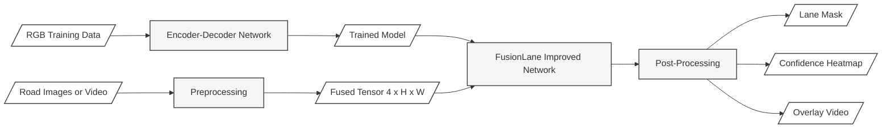

# FusionLane Improved

A PyTorch re-implementation and improvement of the FusionLane multi-sensor lane detection pipeline [1]. Adds ImageNet normalization, data augmentation, hybrid Cross-Entropy + Dice loss [2], confidence-filtered post-processing, morphological cleanup, an LR scheduler, gradient clipping, early stopping, and support for raw road images and dashcam video — all with no dataset required for initial testing.

---

## Table of Contents

1. [Project Overview](#1-project-overview)
2. [What Was Improved](#2-what-was-improved)
3. [File Guide](#3-file-guide)
4. [Setup](#4-setup)
5. [Quick Start — No Data Required](#5-quick-start--no-data-required)
6. [Running on Your Own Video or Images](#6-running-on-your-own-video-or-images)
7. [Easy In-Code Configuration](#7-easy-in-code-configuration)
8. [Training in Depth](#8-training-in-depth)
9. [Inference Outputs Explained](#9-inference-outputs-explained)
10. [Connecting the Full FusionLane Model](#10-connecting-the-full-fusionlane-model)
11. [Using Real TFRecord Data](#11-using-real-tfrecord-data)
12. [Tuning Guide](#12-tuning-guide)
13. [Troubleshooting](#13-troubleshooting)
14. [Architecture Diagram](#14-architecture-diagram)
15. [Works Cited](#15-works-cited)

---

## 1. Project Overview

FusionLane Improved performs **binary lane-marking segmentation** — classifying every pixel in a road image as either background (class 0) or lane (class 1). It is derived from the original FusionLane architecture [1], which fused RGB camera data with region masks through an Xception backbone [3], ASPP module [4], and ConvLSTM temporal head [5].

This improved version keeps the same pipeline structure but replaces or augments several components to improve training stability, output quality, and ease of use.

---

## 2. What Was Improved

| Component | Original | Improved | Why It Matters |
|---|---|---|---|
| **Normalization** | Raw pixel values [0, 255] | ImageNet mean/std normalization [6] | Aligns input distribution with pretrained weight expectations |
| **Augmentation** | None | Random horizontal flip during training | Reduces overfitting; roads are horizontally symmetric |
| **Loss function** | Weighted cross-entropy only | Hybrid CE + Dice loss [2] | Dice loss directly optimizes overlap; CE handles class imbalance |
| **Confidence filtering** | Argmax only | P(lane) > threshold gate before argmax | Removes uncertain pixels that inflate false-positive rates |
| **Post-processing** | None | Morphological open/close + blob removal (scipy [7]) | Eliminates small isolated noise blobs from predictions |
| **LR scheduling** | Constant LR | ReduceLROnPlateau or cosine decay | Prevents LR from being too high late in training |
| **Gradient clipping** | None | `clip_grad_norm_` at each step | Prevents exploding gradients on class-imbalanced batches |
| **Early stopping** | Fixed epoch count | Stops when val mIoU stagnates | Avoids wasted compute and overfitting |
| **Training log** | Terminal only | CSV log per epoch in `outputs/logs/` | Enables post-hoc analysis and plotting |
| **Input modes** | TFRecord only | TFRecord, image folder, video file, dummy data | No dataset needed for development or demos |
| **Video output** | None | Overlay video with green lane annotation | Makes results immediately interpretable |

---

## 3. File Guide

| File | Purpose |
|---|---|
| [dataset_pt.py](dataset_pt.py) | Dataset class with auto-detected input mode, normalization, augmentation, temporal ordering |
| [train_pt.py](train_pt.py) | Model definition, DiceLoss, hybrid loss, training loop with scheduler and early stopping |
| [infer_pt.py](infer_pt.py) | Inference on TFRecord or dummy data; outputs four image subfolders |
| [infer_media.py](infer_media.py) | **Easy entry point** — inference on any road video or image folder you provide |
| [requirements.txt](requirements.txt) | Python package dependencies |

---

## 4. Setup

**Requirements:** Python 3.9 or newer. TensorFlow is optional (only needed for TFRecord loading).

```bash
# Create and activate a virtual environment
python -m venv venv

venv\Scripts\activate          # Windows
# source venv/bin/activate     # Mac / Linux

# Install dependencies
pip install --upgrade pip
pip install -r requirements.txt

# Optional: TFRecord support
pip install tensorflow
```

**Verify the install:**
```bash
python -c "import torch; import cv2; import scipy; import tqdm; print('OK')"
```

---

## 5. Quick Start — No Data Required

The project runs on synthetic dummy data out of the box.

```bash
# Train for 5 epochs on dummy data (64×64 images for speed)
python train_pt.py --epochs 5 --image_height 64 --image_width 64

# Run inference with the saved checkpoint
python infer_pt.py --image_height 64 --image_width 64

# Check outputs
#   outputs/inference/raw/        white pixels = predicted lane
#   outputs/inference/cleaned/    filtered + denoised predictions
#   outputs/inference/heatmap/    blue=uncertain, red=confident
#   outputs/inference/comparison/ 4-panel side-by-side
```

---

## 6. Running on Your Own Video or Images

Use [infer_media.py](infer_media.py) — it handles any road footage with no extra configuration.

### From a dashcam video
```bash
python infer_media.py --input path/to/dashcam.mp4
```
Produces all four image output folders **plus** `outputs/inference/lane_overlay.mp4` — the original video with a semi-transparent green lane drawn on top.

### From a folder of images
```bash
python infer_media.py --input path/to/road_frames/
```
Images are sorted alphabetically. Supported formats: `.jpg` `.jpeg` `.png` `.bmp` `.tiff` `.webp`

### From a single image
```bash
python infer_media.py --input path/to/road.jpg
```

### Supported video formats
`.mp4`  `.avi`  `.mov`  `.mkv`  `.m4v`  `.wmv`  `.flv`

> **Important:** You must train the model first (`python train_pt.py`) to generate `outputs/best_model.pth` before running any inference script.

---

## 7. Easy In-Code Configuration

Every script has a `CONFIG` dictionary near the top. Edit it once and run `python script.py` without typing flags each time. Command-line flags always override CONFIG values.

### `infer_media.py` — for your own video / images

```python
CONFIG = {
    "input":        "./my_road_video.mp4",   # <-- change to your file or folder
    "model_path":   "./outputs/best_model.pth",
    "output_dir":   "./outputs/inference",
    "image_height": 512,    # must match training height
    "image_width":  512,    # must match training width
    "threshold":    0.50,   # lower = more lane pixels kept
    "min_blob":     100,    # minimum blob size to keep (pixels)
    "batch_size":   4,
}
```

### `train_pt.py` — training hyperparameters

```python
CONFIG = {
    "data_dir":     "./data",    # TFRecord folder | image folder | video file
    "model_dir":    "./outputs",
    "epochs":       10,
    "batch_size":   4,           # must be divisible by 4
    "num_workers":  0,
    "image_height": 512,
    "image_width":  512,
    "loss_alpha":   0.5,         # 0 = pure Dice, 1 = pure CE
    "lane_weight":  2.0,
    "bg_weight":    1.0,
    "lr":           1e-3,
    "grad_clip":    1.0,         # 0 to disable gradient clipping
    "patience":     5,           # early-stopping patience (epochs)
    "scheduler":    "plateau",   # "plateau" | "cosine" | "none"
}
```

### `infer_pt.py` — inference on TFRecord / dummy data

```python
CONFIG = {
    "data_dir":     "./data",
    "model_path":   "./outputs/best_model.pth",
    "output_dir":   "./outputs/inference",
    "image_height": 512,
    "image_width":  512,
    "batch_size":   4,
    "threshold":    0.65,
    "min_blob":     200,
    "num_workers":  0,
}
```

---

## 8. Training in Depth

### How input data is auto-detected

You do not need to set an input mode flag — the dataset inspects `data_dir` and picks the right loader:

| Contents of `data_dir` | Mode | Labels |
|---|---|---|
| `train-0000X-of-00004.tfrecord` files | TFRecord | From annotation |
| Image files (`.jpg`, `.png`, etc.) | Image folder | Zeros (inference only) |
| A video file path (`.mp4`, `.avi`, etc.) | Video | Zeros (inference only) |
| Empty or unrecognised | Synthetic dummy data | Synthetic |

### Training command — full example

```bash
python train_pt.py \
  --data_dir      ./data \
  --model_dir     ./outputs \
  --epochs        120 \
  --batch_size    4 \
  --num_workers   0 \
  --image_height  512 \
  --image_width   512 \
  --loss_alpha    0.5 \
  --lane_weight   2.0 \
  --bg_weight     1.0 \
  --lr            1e-3 \
  --grad_clip     1.0 \
  --patience      15 \
  --scheduler     plateau
```

### All training arguments

| Flag | Default | Description |
|---|---|---|
| `--data_dir` | `./data` | Input: TFRecord folder, image folder, or video file |
| `--model_dir` | `./outputs` | Directory for `best_model.pth` and `logs/` |
| `--epochs` | `10` | Maximum training epochs |
| `--batch_size` | `4` | Must be divisible by 4 |
| `--num_workers` | `0` | DataLoader workers (keep 0 with TF-based loading) |
| `--image_height` | `512` | Resize height |
| `--image_width` | `512` | Resize width |
| `--loss_alpha` | `0.5` | CE weight in hybrid loss (0 = pure Dice, 1 = pure CE) |
| `--lane_weight` | `2.0` | Class weight for lane pixels in CE |
| `--bg_weight` | `1.0` | Class weight for background pixels in CE |
| `--lr` | `1e-3` | Initial Adam learning rate |
| `--grad_clip` | `1.0` | Gradient clipping max-norm; `0` to disable |
| `--patience` | `5` | Early-stopping patience in epochs |
| `--scheduler` | `plateau` | LR scheduler: `plateau` / `cosine` / `none` |

### Training outputs

```
outputs/
├── best_model.pth          checkpoint with highest val mIoU
└── logs/
    └── training_log.csv    epoch-by-epoch stats: loss, ce, dice, mIoU, lr
```

The CSV can be opened in Excel or plotted with Python:
```python
import pandas as pd
import matplotlib.pyplot as plt
df = pd.read_csv("outputs/logs/training_log.csv")
df.plot(x="epoch", y=["train_loss", "val_loss"])
plt.show()
```

---

## 9. Inference Outputs Explained

```
outputs/inference/
├── raw/            argmax class map — white = lane (255), black = background (0)
├── cleaned/        confidence-filtered + morphologically cleaned mask
├── heatmap/        P(lane) as a jet colormap (blue=low, red=high confidence)
├── comparison/     4-panel PNG: original | raw | cleaned | heatmap
└── lane_overlay.mp4   (video input only) green overlay on original footage
```

| Output | Best used for |
|---|---|
| `raw/` | Seeing everything the model considers a lane, including noisy predictions |
| `cleaned/` | The primary result — noise and uncertain pixels removed |
| `heatmap/` | Diagnosing where the model is uncertain; picking a `--threshold` value |
| `comparison/` | Quick visual sanity check across all four representations |
| `lane_overlay.mp4` | Showing the result to others or comparing against raw footage |

### Inference command — full example

```bash
python infer_media.py \
  --input         ./dashcam.mp4 \
  --model_path    ./outputs/best_model.pth \
  --output_dir    ./outputs/inference \
  --image_height  512 \
  --image_width   512 \
  --threshold     0.50 \
  --min_blob      100 \
  --batch_size    4
```

---

## 10. Connecting the Full FusionLane Model

The scripts currently use `SimpleFusionLaneNet`, a lightweight placeholder that trains quickly for testing. `train_pt.py` will automatically use the full `FusionLaneModel` from the original paper if `model_pt.py` is present in the same folder:

```python
# train_pt.py — build_model() already tries this:
try:
    from model_pt import FusionLaneModel
    return FusionLaneModel(num_classes=num_classes)
except Exception:
    return SimpleFusionLaneNet(in_channels=4, num_classes=num_classes)
```

**Steps to enable the full model:**

1. Copy `model_pt.py` from the parent `AutonomousDriving/` folder into `fusionlane_improved/`.
2. The full model takes separate `image [B,3,H,W]` and `region [B,1,H,W]` tensors. Update the training loop in `train_pt.py` `train_one_epoch()`:
   ```python
   # Change:
   logits = model(image)
   # To:
   logits = model(image[:, :3], image[:, 3:4], training=True)
   ```
3. Set `--num_classes 7` if using the original 7-class label set (solid, dash, arrow, etc.).

---

## 11. Using Real TFRecord Data

Download the FusionLane TFRecords from the original paper's release and place them in `data/`:

```
data/
├── train-00000-of-00004.tfrecord
├── train-00001-of-00004.tfrecord
├── train-00002-of-00004.tfrecord
├── train-00003-of-00004.tfrecord
├── testing-00000-of-00004.tfrecord
├── testing-00001-of-00004.tfrecord
├── testing-00002-of-00004.tfrecord
└── testing-00003-of-00004.tfrecord
```

Each record must contain three byte-string features:

| Key | Content |
|---|---|
| `image/encoded` | PNG or JPEG-encoded RGB image |
| `region/encoded` | PNG-encoded single-channel road-region mask |
| `label/encoded` | PNG-encoded single-channel label map |

If your TFRecord uses different key names, update the `feat` dict in `dataset_pt.py` inside `_load_tfrecords()`.

---

## 12. Tuning Guide

| Parameter | Raise when | Lower when |
|---|---|---|
| `--threshold` | Too many false positives in `cleaned/` | Real lanes disappear from `cleaned/` |
| `--min_blob` | Small isolated dots persist in `cleaned/` | Dashed lane segments are erased |
| `--loss_alpha` | Model over-segments (Dice loss not helping) | Model misses lane pixels entirely |
| `--lane_weight` | Lane pixels are consistently missed (low recall) | Everything predicted as lane (low precision) |
| `--lr` | Training converges very slowly | Loss becomes NaN or oscillates |
| `--grad_clip` | Losses spike suddenly during training | No effect (clip is rarely triggered) |
| `--patience` | Training stops too early on noisy data | Model overfits with no improvement for many epochs |
| `--scheduler` | Switch from `plateau` to `cosine` for smoother decay on long runs | — |

---

## 13. Troubleshooting

| Problem | Solution |
|---|---|
| `ModuleNotFoundError: tensorflow` | Install it separately (`pip install tensorflow`) or ignore it — code uses dummy/image/video data automatically |
| `FileNotFoundError: best_model.pth` | Run `train_pt.py` first to generate the checkpoint |
| `AssertionError: batch_size must be divisible by 4` | Use `--batch_size 4`, `8`, `12`, etc. |
| `cleaned/` output is all black | Lower `--threshold` (try `0.30`) or lower `--min_blob` (try `10`) |
| `heatmap/` is entirely blue | Model is under-confident — train for more epochs or with a larger `--lane_weight` |
| `loss is NaN` during training | Lower `--lr` (try `1e-4`) or enable `--grad_clip 1.0` |
| Video loads only first 500 frames | Split your clip into shorter segments, or increase the frame cap in `_load_video()` inside `dataset_pt.py` |
| Training stops too early | Increase `--patience` (e.g. `--patience 20`) |
| LR not decreasing with `plateau` | Check that val mIoU is actually being computed (non-zero labels required) |

---

## 14. Architecture Diagram

The diagram below mirrors the style of the original FusionLane paper figure — parallelograms for data, rectangles for networks and processes. Paste the Mermaid block at [mermaid.live](https://mermaid.live) to export a high-resolution SVG or PNG suitable for a research paper.



**Reading the diagram:**

| Shape | Meaning |
|---|---|
| Parallelogram | Data / dataset / stored artifact |
| Rectangle | Network, model, or processing step |

**Training path** (top row): RGB training data feeds the encoder-decoder, producing the saved model checkpoint.

**Inference path** (bottom rows): Road images or video are preprocessed into a 4-channel tensor (RGB + region mask), passed through the trained network, and cleaned by confidence thresholding and morphological post-processing to produce lane masks, heatmaps, and an annotated overlay video.

---

## 15. Works Cited

[1] Yin, R., Cheng, Y., Wu, H., Song, Y., Yu, B., & Niu, R. (2020). FusionLane: Multi-sensor fusion for lane marking semantic segmentation using deep neural networks. *IEEE Transactions on Intelligent Transportation Systems, 23*(2), 1543–1553. https://doi.org/10.1109/TITS.2020.3030086

[2] Milletari, F., Navab, N., & Ahmadi, S. A. (2016). V-Net: Fully convolutional neural networks for volumetric medical image segmentation. *Proceedings of the 2016 Fourth International Conference on 3D Vision (3DV)*, 565–571. https://doi.org/10.1109/3DV.2016.79

[3] Chollet, F. (2017). Xception: Deep learning with depthwise separable convolutions. *Proceedings of the IEEE Conference on Computer Vision and Pattern Recognition (CVPR)*, 1251–1258. https://doi.org/10.1109/CVPR.2017.195

[4] Chen, L.-C., Zhu, Y., Papandreou, G., Schroff, F., & Adam, H. (2018). Encoder-decoder with atrous separable convolution for semantic image segmentation (DeepLabV3+). *Proceedings of the European Conference on Computer Vision (ECCV)*, 801–818. https://doi.org/10.1007/978-3-030-01234-2_49

[5] Xingjian, S., Chen, Z., Wang, H., Yeung, D.-Y., Wong, W.-K., & Woo, W.-c. (2015). Convolutional LSTM network: A machine learning approach for precipitation nowcasting. *Advances in Neural Information Processing Systems (NeurIPS) 28*. https://proceedings.neurips.cc/paper/2015/hash/07563a3fe3bbe7e3ba84431ad9d055af-Abstract.html

[6] Russakovsky, O., Deng, J., Su, H., Krause, J., Satheesh, S., Ma, S., ... & Fei-Fei, L. (2015). ImageNet large scale visual recognition challenge. *International Journal of Computer Vision, 115*(3), 211–252. https://doi.org/10.1007/s11263-015-0816-y

[7] Virtanen, P., Gommers, R., Oliphant, T. E., Haberland, M., Reddy, T., Cournapeau, D., ... & SciPy 1.0 Contributors. (2020). SciPy 1.0: Fundamental algorithms for scientific computing in Python. *Nature Methods, 17*(3), 261–272. https://doi.org/10.1038/s41592-020-0772-5

[8] Paszke, A., Gross, S., Massa, F., Lerer, A., Bradbury, J., Chanan, G., ... & Chintala, S. (2019). PyTorch: An imperative style, high-performance deep learning library. *Advances in Neural Information Processing Systems (NeurIPS) 32*. https://proceedings.neurips.cc/paper/2019/hash/bdbca288fee7f92f2bfa9f7012727740-Abstract.html

[9] Bradski, G. (2000). The OpenCV library. *Dr. Dobb's Journal of Software Tools*. https://opencv.org

[10] Ioffe, S., & Szegedy, C. (2015). Batch normalization: Accelerating deep network training by reducing internal covariate shift. *Proceedings of the 32nd International Conference on Machine Learning (ICML)*, 448–456. https://proceedings.mlr.press/v37/ioffe15.html
