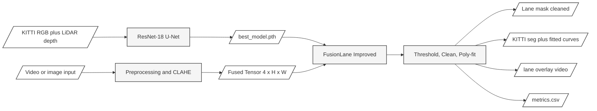

# FusionLane Improved

A camera and LiDAR fusion lane detection pipeline built on PyTorch. Uses a ResNet-18 U-Net
backbone with a 4-channel input (3 RGB + 1 LiDAR depth), trained end-to-end on the KITTI Road
benchmark to achieve val mIoU 0.9405.

---

## Table of Contents

1. [How This Works](#1-how-this-works)
2. [Data Sources](#2-data-sources)
3. [Setup](#3-setup)
4. [Step-by-Step: Reproduce the Full Pipeline](#4-step-by-step-reproduce-the-full-pipeline)
5. [Running Inference on Your Own Video](#5-running-inference-on-your-own-video)
6. [Evaluating Fusion vs Camera-Only](#6-evaluating-fusion-vs-camera-only)
7. [Running the Edge Case Tests](#7-running-the-edge-case-tests)
8. [Output Files Explained](#8-output-files-explained)
9. [Pipeline Improvement Flags](#9-pipeline-improvement-flags)
10. [Comparing Against Reference Outputs](#10-comparing-against-reference-outputs)
11. [File Guide](#11-file-guide)
12. [Model Architecture](#12-model-architecture)
13. [What Was Improved](#13-what-was-improved)
14. [Training Arguments Reference](#14-training-arguments-reference)
15. [Tuning Guide](#15-tuning-guide)
16. [Troubleshooting](#16-troubleshooting)
17. [Sources and Datasets](#17-sources-and-datasets)
18. [Architecture Diagram](#18-architecture-diagram)

---

## 1. How This Works

This is a fusion model - it processes two sensor streams simultaneously:

- **Camera (RGB):** sees what lane markings look like visually.
- **LiDAR depth:** sees where the road surface is in 3D space.

Both signals are stacked into a single 4-channel tensor [R, G, B, depth] and passed through the
network in one forward pass. The model learns to use both channels together. Camera alone can fail
on faded markings or poor lighting; LiDAR alone cannot read lane paint. Combined, they produce
more precise and more reliable detections for an autonomous vehicle to stay within lane lines.

When LiDAR is not available (e.g., dashcam-only footage), channel 4 defaults to all-ones and the
model falls back to camera-only mode automatically without any code change.

---

## 2. Data Sources

### Training data - KITTI Road benchmark

**What it is:** 289 labelled road images (Urban Marked split) paired with Velodyne HDL-64E LiDAR
point clouds and binary lane ground-truth masks.

**Where it comes from:** Downloaded automatically by `prepare_kitti.py` from the public KITTI
benchmark server. See [Sources and Datasets](#17-sources-and-datasets) for the exact URL.

**How it was split:** 80% train (232 images) / 20% val (57 images), random with seed 42.

**How LiDAR is used:** Each `.bin` point cloud is projected onto the camera image plane using the
calibration matrices provided by KITTI. The result is a sparse depth map (approximately 3.6%
non-zero pixels) stored as a uint8 PNG and loaded as channel 4 during training.

**Ground-truth mask format:** KITTI encodes the GT in BGR colour values:
- `[0, 0, 255]` - visible road surface (background class)
- `[255, 0, 255]` - ego-lane / lane markings (positive lane class)
- `[0, 0, 0]` - outside camera field of view

### Test videos - dashcam recordings

Two personal dashcam recordings are used for qualitative inference testing only. They have no
ground-truth masks, so mIoU cannot be computed on them directly.

- **input.mp4** - 311 frames, 30 fps. Challenging scene; very low model confidence due to domain
  gap from KITTI training data. The classical Hough baseline also fails on the right lane (0%
  detection rate).
- **input (2).mp4** - 222 frames, 24 fps. Clear lane scene. The fusion model detects lanes in
  99.5% of frames with mean confidence 0.91.

### Reference outputs - original FusionLane model

`outputs/reference/` contains pre-generated outputs from the original TensorFlow-based FusionLane
model (Xception backbone, 7 lane classes, LiDAR BEV input). These are used for visual comparison
only and represent what the earlier version of the model produced.

| Folder | Training condition | Output style |
|--------|--------------------|--------------|
| `output_60epochs/` | 60-epoch model | LiDAR Bird's Eye View + coloured lane predictions |
| `output_boosted/` | 60-epoch + post-processing | LiDAR BEV, enhanced |
| `output_images_pretrained/` | ImageNet-pretrained weights | LiDAR BEV |
| `output_pretrained/` | Pretrained, camera view | KITTI-style segmentation (red bg, magenta lane) |
| `output_images/` | Camera-only, no LiDAR | Near-black with sparse dots - low-confidence output |

---

## 3. Setup

**Requirements:** Python 3.9 or newer, approximately 6 GB free disk space for the KITTI dataset.

```bash
# 1. Create and activate a virtual environment
python -m venv venv

venv\Scripts\activate          # Windows
# source venv/bin/activate     # Mac / Linux

# 2. Install all dependencies
pip install --upgrade pip
pip install -r requirements.txt

# 3. Verify the install
python -c "import torch; import cv2; import scipy; print('OK')"
```

Optional - TFRecord support (only needed to load original FusionLane TFRecords):
```bash
pip install tensorflow
```

---

## 4. Step-by-Step: Reproduce the Full Pipeline

These are the exact commands used to prepare data, train, and evaluate this model from scratch.

### Step 1 - Download and prepare KITTI Road data

`prepare_kitti.py` handles the download, extraction, LiDAR projection, GT mask conversion, and
80/20 split automatically:

```bash
python prepare_kitti.py \
  --kitti_root ./kitti_data \
  --output_dir ./data \
  --val_split  0.20 \
  --seed       42
```

This downloads two files (approximately 1.5 GB total) from the KITTI S3 bucket:
- `data_road.zip` (471 MB) - camera images and GT lane masks
- `data_road_velodyne.zip` (1.1 GB) - Velodyne LiDAR .bin files

After completion the prepared dataset is organised as:

```
data/
  train/
    images/   kitti_000000.jpg ... kitti_000231.jpg    (232 files)
    masks/    kitti_000000.png ... kitti_000231.png    (232 binary lane masks)
    depths/   kitti_000000.png ... kitti_000231.png    (232 LiDAR depth maps)
  val/
    images/   kitti_000000.jpg ... kitti_000056.jpg    (57 files)
    masks/    kitti_000000.png ... kitti_000056.png    (57 GT masks)
    depths/   kitti_000000.png ... kitti_000056.png    (57 LiDAR depth maps)
```

### Step 2 - Train the fusion model

```bash
python train_pt.py \
  --data_dir     ./data \
  --model_dir    ./outputs \
  --epochs       50 \
  --batch_size   4 \
  --lr           3e-4 \
  --patience     10 \
  --scheduler    plateau \
  --lane_weight  4.0 \
  --image_height 256 \
  --image_width  256
```

Training automatically:
- Detects the `depths/` folder and uses LiDAR depth as channel 4 (fusion mode)
- Downloads ImageNet-pretrained ResNet-18 weights (approximately 45 MB) on first run
- Saves the best checkpoint to `outputs/best_model.pth` when val mIoU improves
- Writes a per-epoch log to `outputs/logs/training_log.csv`
- Stops early when val mIoU does not improve for `--patience` consecutive epochs

**Training results achieved on KITTI Road (this run):**

| Epoch | Val mIoU | Learning Rate |
|-------|----------|---------------|
| 1 | 0.8136 | 3.00e-04 |
| 7 | 0.9086 | 3.00e-04 |
| 12 | 0.9306 | 3.00e-04 |
| 17 | 0.9270 | 1.50e-04 |
| 26 | **0.9405** | 7.50e-05 - best checkpoint saved |
| 36 | - | Early stopping triggered (patience=10) |

### Step 3 - Run inference on dashcam video

The model was trained at 256 x 256. Running inference at 512 x 512 is valid and improves
fine-grained detail in the output, since the model's receptive field covers more of the scene.

```bash
# Basic inference (camera-only mode, threshold=0.50)
python infer_media.py \
  --input        "path/to/dashcam.mp4" \
  --output_dir   ./outputs/inference_run1 \
  --image_height 512 \
  --image_width  512 \
  --threshold    0.50 \
  --min_blob     100

# Full inference with all pipeline improvements
python infer_media.py \
  --input              "path/to/dashcam.mp4" \
  --output_dir         ./outputs/inference_run1_improved \
  --image_height       512 \
  --image_width        512 \
  --use_clahe \
  --temporal_alpha     0.60 \
  --adaptive_threshold \
  --fit_lanes
```

### Step 4 - Evaluate fusion vs camera-only on the KITTI val split

This evaluation uses the 57 validation images, which have both real LiDAR depth maps and
ground-truth lane masks. It computes mIoU for fusion mode and camera-only mode separately.

```bash
python eval_fusion.py \
  --data_dir     ./data \
  --model_path   ./outputs/best_model.pth \
  --output_dir   ./outputs/eval_fusion \
  --image_height 256 \
  --image_width  256 \
  --threshold    0.50
```

**Evaluation results on 57 validation samples:**

| Metric | Camera-only | Fusion (Camera + LiDAR) | Delta |
|--------|-------------|------------------------|-------|
| mIoU | 0.9313 | **0.9375** | +0.0063 |
| Dice (F1) | 0.9327 | **0.9385** | +0.0058 |
| Precision | 0.9098 | **0.9273** | +0.0175 |
| Recall | 0.9721 | 0.9650 | -0.0071 |

Fusion outperformed camera-only on 43 of 57 samples (75%). The precision gain (+0.0175) is the
most safety-critical figure for autonomous driving - it means the fusion model makes fewer false
detections on the road surface where none exist.

### Step 5 - Run the edge case test suite

```bash
python run_edge_case_tests.py
```

Expected output: `EDGE CASE TEST RESULTS: 49/49 passed`

### Step 6 - Generate the output comparison grid

```bash
python compare_outputs.py \
  --our_dir     ./outputs/inference_video2_improved \
  --frames      0 10 20 30 40 50 60 \
  --output_file ./outputs/comparison_grid.png
```

Produces a PNG grid with 8 columns (5 reference model outputs + 3 improved model outputs) and one
row per selected frame.

---

## 5. Running Inference on Your Own Video

`infer_media.py` accepts any dashcam video, image folder, or single image. A trained checkpoint
at `outputs/best_model.pth` must exist before running inference.

```bash
# Minimal command - uses CONFIG defaults
python infer_media.py --input path/to/dashcam.mp4

# Explicit full command
python infer_media.py \
  --input          path/to/dashcam.mp4 \
  --model_path     ./outputs/best_model.pth \
  --output_dir     ./outputs/my_run \
  --image_height   512 \
  --image_width    512 \
  --threshold      0.50 \
  --min_blob       100 \
  --batch_size     4
```

**Supported input types:**
- Video: `.mp4` `.avi` `.mov` `.mkv` `.m4v` `.wmv` `.flv`
- Image folder: any folder of `.jpg` `.jpeg` `.png` `.bmp` `.tiff` `.webp` files (alphabetical order)
- Single image: any of the above image formats

**Default CONFIG values in `infer_media.py`:**

| Parameter | Default | Description |
|-----------|---------|-------------|
| `image_height` | 256 | Input height to model (trained at this size) |
| `image_width` | 256 | Input width to model |
| `threshold` | 0.25 | P(lane) minimum confidence to keep a pixel |
| `min_blob` | 50 | Minimum connected component size in pixels |
| `roi_top` | 0.40 | Top fraction of frame blanked (sky suppression) |
| `batch_size` | 4 | Frames processed per forward pass |

**Note on LiDAR for dashcam footage:**
Dashcam videos have no LiDAR sensor. Channel 4 defaults to all-ones automatically (camera-only
mode). To simulate a depth signal using monocular depth estimation, pass `--use_depth`. This
requires `pip install transformers` and downloads approximately 100 MB on first run.

```bash
python infer_media.py --input dashcam.mp4 --use_depth
```

---

## 6. Evaluating Fusion vs Camera-Only

`eval_fusion.py` runs a side-by-side comparison on any dataset that has images, masks, and LiDAR
depth maps. The KITTI val split (prepared in Step 1) is the primary intended input.

```bash
python eval_fusion.py \
  --data_dir     ./data \
  --model_path   ./outputs/best_model.pth \
  --output_dir   ./outputs/eval_fusion \
  --image_height 256 \
  --image_width  256 \
  --threshold    0.50
```

Note: `--image_height` and `--image_width` must match the values used during training (256 x 256
for the KITTI run). Using a different size will produce different mIoU values than reported above.

**Output files per sample:**
- `camera_only/kitti_XXXXXX.png` - 4-panel: camera image | blank | camera-only prediction (green) | ground truth (cyan)
- `fusion/kitti_XXXXXX.png` - 4-panel: camera image | LiDAR depth (jet colourmap) | fusion prediction (green) | ground truth (cyan)
- `metrics.csv` - per-sample mIoU, Dice, Recall, Precision for both modes
- `summary.txt` - overall statistics and aggregate comparison

---

## 7. Running the Edge Case Tests

The test suite covers 49 edge cases across all pipeline components.

```bash
python run_edge_case_tests.py
```

Expected result: `EDGE CASE TEST RESULTS: 49/49 passed`

**Test categories:**

| Category | What is tested |
|----------|---------------|
| Preprocessing | All-black, all-white, 1x1 pixel, and depth-channel inputs |
| EMA smoothing | alpha=0, alpha=1, first frame (prev=None), output bounds |
| Adaptive Otsu | Flat confidence maps, bimodal maps, floor and ceiling clamp |
| Clean mask / ROI | Empty mask, all-lane mask, tiny/large blobs, boundary roi values |
| Polynomial fitting | Empty, vertical line, tiny component, horizontal blob fallback |
| KITTI seg colourmap | Correct BGR for background [0,0,220] and lane [220,0,220] |
| Dataset loader | No depth folder (camera-only fallback), with depth (fusion), empty folder |
| Fusion metrics | Perfect prediction, all-wrong, empty GT, all false positives |
| Model forward pass | 256x256, 512x512, zero input, extreme input, NaN/Inf check |

---

## 8. Output Files Explained

After running `infer_media.py` the output directory contains:

```
outputs/my_run/
  raw/              Argmax prediction - white=lane, black=background
  cleaned/          Confidence-filtered and morphologically cleaned mask (primary result)
  heatmap/          P(lane) as jet colourmap - blue=low confidence, red=high confidence
  comparison/       4-panel PNG: original | raw | cleaned | heatmap (metrics overlaid)
  kitti_seg/        KITTI-style coloured segmentation - red background, magenta lane
  fitted/           Polynomial curve fits (only when --fit_lanes is set)
  lane_overlay.mp4  Original video with green lane overlay (video input only)
  metrics.csv       Per-frame: lane_pct, mean_conf, temporal_iou, threshold_used, ...
```

| Output | Best used for |
|--------|--------------|
| `cleaned/` | Primary detection result for downstream use |
| `heatmap/` | Diagnosing confidence - use this to decide whether to raise or lower `--threshold` |
| `kitti_seg/` | Visual comparison against reference outputs |
| `fitted/` | Clean geometric lane lines suitable for visualisation |
| `metrics.csv` | Quantitative analysis - open in Excel or pass to `analyze_results.py` |
| `lane_overlay.mp4` | Presenting results on the original video |

**Running analysis across multiple runs:**

```bash
python analyze_results.py \
  --dl       "run1:./outputs/inference_run1" \
             "run2:./outputs/inference_run2" \
  --baseline "run1:./outputs/baseline_run1" \
  --output_dir ./outputs/analysis

# Print a full statistics table to the terminal
python stats_report.py
```

---

## 9. Pipeline Improvement Flags

Four optional flags in `infer_media.py` improve detection quality on new footage. All can be
combined freely without any retraining.

| Flag | What it does | When to use |
|------|-------------|-------------|
| `--use_clahe` | CLAHE adaptive contrast on L* channel before model input | Footage darker or brighter than KITTI training data |
| `--temporal_alpha 0.6` | EMA smoothing of confidence maps across consecutive frames | Any video input - reduces frame-to-frame flicker |
| `--adaptive_threshold` | Per-frame Otsu threshold instead of fixed `--threshold` | Varying scene lighting or different camera dynamic range |
| `--fit_lanes` | Degree-2 polynomial fit to detected lane blobs | Cleaner geometric output; does not affect cleaned/ or metrics |
| `--use_depth` | DPT monocular depth estimate as pseudo-LiDAR channel 4 | Dashcam without real LiDAR (requires `pip install transformers`) |
| `--roi_top 0.40` | Blank top fraction of frame before thresholding | Suppress false positives in sky or horizon regions |

**Recommended combination for dashcam footage:**

```bash
python infer_media.py \
  --input              path/to/dashcam.mp4 \
  --output_dir         ./outputs/run_improved \
  --image_height       512 \
  --image_width        512 \
  --use_clahe \
  --temporal_alpha     0.60 \
  --adaptive_threshold \
  --fit_lanes
```

---

## 10. Comparing Against Reference Outputs

`compare_outputs.py` places all output styles side by side in a single PNG grid.

```bash
# Compare 7 frames against all 5 reference styles
python compare_outputs.py \
  --our_dir     ./outputs/inference_video2_improved \
  --frames      0 10 20 30 40 50 60 \
  --output_file ./outputs/comparison_grid.png

# Auto-select 8 evenly spaced frames
python compare_outputs.py --n_frames 8

# Reference columns only (no improved model)
python compare_outputs.py --no_our

# Improved model columns only (no reference)
python compare_outputs.py --no_ref

# Use a different inference run
python compare_outputs.py --our_dir ./outputs/inference_video1_improved
```

The output is a PNG grid where each row is a frame and each column is an output type. A green
vertical bar separates the 5 reference model columns from the 3 improved model columns.

---

## 11. File Guide

### Core pipeline

| File | Purpose |
|------|---------|
| `train_pt.py` | Training loop - hybrid CE+Dice loss, mIoU metric, LR scheduler, early stopping, CSV log |
| `model_pt.py` | ResNet-18 U-Net backbone with ImageNet pretrained weights; auto-detected by `train_pt.py` |
| `dataset_pt.py` | Dataset loader - auto-detects TFRecord / paired folder / video / dummy; loads LiDAR depth if `depths/` is present |
| `infer_media.py` | Primary inference script for any video or image input |
| `infer_pt.py` | Inference on labelled TFRecord data with GT mIoU evaluation |

### Data preparation

| File | Purpose |
|------|---------|
| `prepare_kitti.py` | Downloads KITTI Road (camera + Velodyne LiDAR), projects point clouds to depth maps, splits 80/20 |
| `prepare_data.py` | Multi-source converter: TuSimple (JSON), CULane (seg masks / .lines.txt), CVAT (Segmentation Masks 1.1) |

### Evaluation and testing

| File | Purpose |
|------|---------|
| `eval_fusion.py` | Runs fusion vs camera-only evaluation on any paired dataset with GT masks; outputs per-sample and aggregate metrics |
| `run_edge_case_tests.py` | 49-test edge case suite covering all pipeline components |
| `infer_baseline.py` | Classical Canny + Hough-line detector (no training required; used as a comparison baseline) |
| `analyze_results.py` | Reads metrics CSVs from DL and baseline runs; produces a statistical report and combined CSV |
| `stats_report.py` | Prints full per-run statistics table (training log + inference metrics) to the terminal |
| `compare_outputs.py` | Generates a side-by-side comparison PNG grid of reference and improved model outputs |

### Documentation

| File | Purpose |
|------|---------|
| `TRAINING_GUIDE.md` | Extended guide: TuSimple / CULane / CVAT annotation workflows, hyperparameter reference |
| `requirements.txt` | Python package dependencies with minimum version pins |

---

## 12. Model Architecture

The model takes a 4-channel input and produces per-pixel binary logits.

```
Input  [B, 4, H, W]
  |    Channel 0-2: RGB normalised to ImageNet mean/std
  |    Channel 3:   LiDAR depth map in [0, 1] (or all-ones for camera-only mode)
  |
  +-- Encoder: ResNet-18 pretrained on ImageNet-1K
  |   (approx. 45 MB, downloaded automatically on first run)
  |
  |   enc0 : [B,  64, H/2,  W/2]   <- conv1 + bn + relu
  |   enc1 : [B,  64, H/4,  W/4]   <- layer1
  |   enc2 : [B, 128, H/8,  W/8]   <- layer2
  |   enc3 : [B, 256, H/16, W/16]  <- layer3
  |   enc4 : [B, 512, H/32, W/32]  <- layer4
  |
  +-- Decoder: U-Net with skip connections (trained from scratch)
  |
  |   dec4 : [B, 256, H/16, W/16]  (upsample enc4, fuse enc3 skip)
  |   dec3 : [B, 128, H/8,  W/8]   (upsample dec4, fuse enc2 skip)
  |   dec2 : [B,  64, H/4,  W/4]   (upsample dec3, fuse enc1 skip)
  |   dec1 : [B,  32, H/2,  W/2]   (upsample dec2, fuse enc0 skip)
  |   out  : [B,   2, H,    W]     <- 1x1 conv head: background / lane logits

Total parameters: 14,952,066
```

**Channel 4 initialisation:** The standard 3-channel ResNet-18 conv1 is extended to 4 channels. The
4th filter is initialised to the mean of the 3 RGB filters so the ImageNet pretraining is preserved.

**Fallback model:** If `model_pt.py` is absent, `train_pt.py` automatically uses `SimpleFusionLaneNet`
(3-block strided encoder, 2-block transpose decoder, approximately 400K parameters).

---

## 13. What Was Improved

| Component | Before | After |
|-----------|--------|-------|
| Normalisation | Raw pixel values [0, 255] | ImageNet mean/std |
| Augmentation | None | Random horizontal flip + brightness jitter |
| Loss function | Cross-entropy only | Hybrid CE + Dice |
| Confidence filtering | Argmax only | P(lane) > threshold gate |
| Post-processing | None | Morphological open/close + blob removal |
| LR scheduling | Constant | ReduceLROnPlateau or cosine |
| Gradient clipping | None | clip_grad_norm_ per step |
| Early stopping | None | Stops when val mIoU stagnates |
| Training log | Terminal only | CSV per epoch |
| Input modes | TFRecord only | TFRecord, paired folder, video, image folder, dummy |
| Inference extras | None | CLAHE, EMA smoothing, adaptive Otsu threshold, polynomial fitting |

---

## 14. Training Arguments Reference

| Flag | Default | Description |
|------|---------|-------------|
| `--data_dir` | `./data` | Prepared dataset root (must contain `train/` and `val/`) |
| `--model_dir` | `./outputs` | Where `best_model.pth` and `logs/` are written |
| `--epochs` | `10` | Maximum training epochs |
| `--batch_size` | `4` | Must be divisible by 4 |
| `--image_height` | `512` | Resize height (use 256 for faster training on KITTI) |
| `--image_width` | `512` | Resize width |
| `--lr` | `1e-3` | Initial Adam learning rate (3e-4 recommended for KITTI) |
| `--loss_alpha` | `0.5` | CE fraction in hybrid loss (0=pure Dice, 1=pure CE) |
| `--lane_weight` | `2.0` | Class weight for lane pixels (raise to improve recall) |
| `--grad_clip` | `1.0` | Gradient clipping max-norm (0 to disable) |
| `--patience` | `5` | Early-stopping patience in epochs |
| `--scheduler` | `plateau` | LR scheduler: plateau / cosine / none |

---

## 15. Tuning Guide

| Symptom | Recommended change |
|---------|-------------------|
| `cleaned/` output is all black | Lower `--threshold` (try 0.30) or `--min_blob` (try 10) |
| Too many false-positive detections | Raise `--threshold` or `--min_blob` |
| Model consistently misses lane pixels (low recall) | Raise `--lane_weight` |
| Everything is predicted as lane (low precision) | Lower `--lane_weight` |
| Training loss is NaN | Lower `--lr` or set `--grad_clip 1.0` |
| Training stops too early | Raise `--patience` to 15 or 20 |
| Flickering detections in video output | Add `--temporal_alpha 0.6` |
| Footage noticeably darker or brighter than training data | Add `--use_clahe` |
| Threshold wrong for a new camera or environment | Add `--adaptive_threshold` |

---

## 16. Troubleshooting

| Error | Fix |
|-------|-----|
| `ModuleNotFoundError: tensorflow` | Run `pip install tensorflow` or ignore - the code falls back to image/video/dummy mode automatically |
| `FileNotFoundError: best_model.pth` | Run `train_pt.py` first (Step 2 above) |
| `AssertionError: batch_size must be divisible by 4` | Use `--batch_size 4`, `8`, `12`, etc. |
| `RuntimeError: Error loading state_dict` | Model architecture changed - delete `best_model.pth` and retrain |
| `heatmap/` is entirely blue | Model is under-confident - train for more epochs or increase `--lane_weight` |
| Video loads only the first 500 frames | Increase the frame cap in `_load_video()` inside `dataset_pt.py` |
| `eval_fusion.py` mIoU lower than training log | Check that `--image_height` and `--image_width` match the training size (256 for the KITTI run) |
| Edge case tests fail | Run `pip install -r requirements.txt` and confirm Python 3.9 or newer |

---

## 17. Sources and Datasets

### Datasets

| Dataset | Purpose in this project | Access |
|---------|------------------------|--------|
| KITTI Road benchmark | Training and validation (camera + LiDAR + GT masks) | http://www.cvlibs.net/datasets/kitti/eval_road.php |
| TuSimple | Optional training source (JSON lane annotations, ~6 K frames) | https://github.com/TuSimple/tusimple-benchmark |
| CULane | Optional training source (133 K frames, urban and highway) | https://xingangpan.github.io/projects/CULane.html |
| CVAT (annotation tool) | Custom dashcam annotation and export | https://app.cvat.ai |

### Software and frameworks

| Software | Role | Reference |
|----------|------|-----------|
| PyTorch | Deep learning framework | https://pytorch.org |
| torchvision | ResNet-18 pretrained weights (ImageNet-1K) | https://pytorch.org/vision/stable/models/resnet.html |
| OpenCV | Image I/O, CLAHE, Hough transform, morphological operations | https://opencv.org |
| SciPy | Connected-component labelling and morphological post-processing | https://scipy.org |
| HuggingFace Transformers | DPT monocular depth estimation (pseudo-LiDAR, optional) | https://huggingface.co/Intel/dpt-swin2-tiny-256 |

### Key algorithmic references

| Method | Reference |
|--------|-----------|
| ResNet-18 backbone | He, K., Zhang, X., Ren, S., and Sun, J. (2016). Deep residual learning for image recognition. CVPR 2016. https://doi.org/10.1109/CVPR.2016.90 |
| U-Net decoder | Ronneberger, O., Fischer, P., and Brox, T. (2015). U-Net: Convolutional networks for biomedical image segmentation. MICCAI 2015. https://doi.org/10.1007/978-3-319-24574-4_28 |
| Dice loss | Milletari, F., Navab, N., and Ahmadi, S. (2016). V-Net: Fully convolutional neural networks for volumetric medical image segmentation. 3DV 2016. https://doi.org/10.1109/3DV.2016.79 |
| ImageNet pretraining | Russakovsky, O. et al. (2015). ImageNet large scale visual recognition challenge. IJCV 115(3), 211-252. https://doi.org/10.1007/s11263-015-0816-y |
| KITTI benchmark | Geiger, A. et al. (2012). Are we ready for autonomous driving? The KITTI vision benchmark suite. CVPR 2012. https://doi.org/10.1109/CVPR.2012.6248074 |
| Otsu thresholding | Otsu, N. (1979). A threshold selection method from gray-level histograms. IEEE Transactions on Systems, Man, and Cybernetics 9(1), 62-66. https://doi.org/10.1109/TSMC.1979.4310076 |
| CLAHE | Pizer, S. et al. (1987). Adaptive histogram equalization and its variations. Computer Vision, Graphics, and Image Processing 39(3), 355-368. https://doi.org/10.1016/S0734-189X(87)80186-X |

---

## 18. Architecture Diagram

Paste the Mermaid block at https://mermaid.live to render or export as SVG or PNG.


